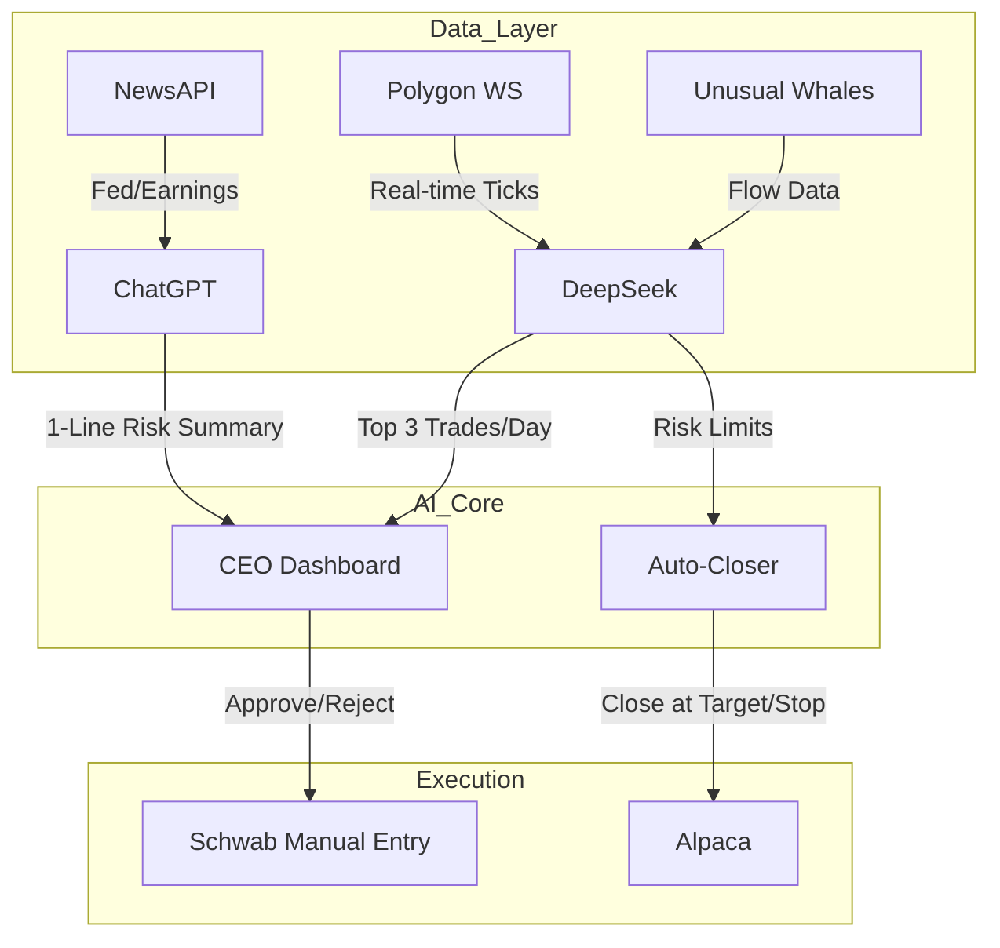

✨ Overview
A modular, semi-automated trading system designed for high-performance scalping and momentum strategies, specifically 0DTE options on QQQ, TSLA, and PLTR.
## ⚙️ System Architecture



## 🔧 What’s IN (Necessary)
| Component | Why It’s Critical | Time |
|----------|-------------------|------|
| 0DTE Scanner | Targets 80% win rate setups (SPX/QQQ) | 2d |
| Pre-Market Gapper Alerts | Finds morning momentum plays | 1d |
| Dark Pool Radar | Flags hidden institutional moves | Integrated |
| CEO Dashboard | Your "command center" | 3d |
| Auto-Closer | Locks in profits/stops (Alpaca) | 1d |

## 🚫 What’s OUT (Over-Engineering)
| Component | Reason |
|-----------|--------|
| Spoofing Detection | Not needed for 0DTE/momentum |
| Pump Chatter Alerts | Low ROI vs. Unusual Whales flow |
| Multi-Broker Routing | Schwab manual + Alpaca auto is enough |
| HFT Optimizations | Irrelevant for trading window |

## 🧠 AI Roles
| AI | Role | Code File |
|----|------|-----------|
| DeepSeek | Quant Analyst | deepseek_scanner.py |
| ChatGPT | Risk Manager | chatgpt_risk_check.py |


## 📁 Developer Deliverables
### Core Files
```python
# deepseek_scanner.py
# 0DTE SPX/QQQ momentum scanner

# chatgpt_risk_check.py
# 1-line veto power

# auto_closer.py
# Closes trades at +/- thresholds
```
### CEO Ritual (5 min/day)
- 9:00 AM: Review DeepSeek's top 3 trades
- 9:05 AM: Read ChatGPT veto
- 9:10 AM: Enter trade in Schwab **only if**:
  - ChatGPT = YES
  - Your gut agrees (CEO override power)
## ⚡ Pro Optimizations
| Hedge Fund ($20M) | Your Version |
|-------------------|--------------|
| Co-located Servers | Polygon WS |
| Custom VWAP Algos | Volume-weighted limit orders |
| Quant Teams | DeepSeek + ChatGPT |

## 🛠️ Developer Notes
**Core Principles**
- **KISS**: No spaghetti code. Profit-driven logic only.
- **Naming**: `deepseek_scanner.py`, not `scanner_v2_final.py`
- **Logging**: Timestamp every `YES/NO` decision + PnL

**Testing**
- Backtest SPX/QQQ 0DTE (Jan 2024–present) before live deployment
- TSLA/PLTR optional (lower liquidity)

**Safety**
- ChatGPT vetoes can be overridden by CEO (you)

**Efficiency**
- Optimize for readability first, speed second

**Error Handling**
- All API calls (Alpaca, Polygon, OpenAI) must include retries + fallbacks
- Example: `alpaca.submit_order()` → auto-retry 2x if rate-limited

## 📜 Final Specs
- Language: Python
- Data: Polygon + Unusual Whales
- Execution: Alpaca (auto), Schwab (manual)
- Alerts: Discord/Telegram
- Backend: AWS Lambda (serverless)
## 🎯 Launch Checklist
- [ ] DeepSeek Scanner
- [ ] ChatGPT Risk Summaries
- [ ] Auto-Closer
- [ ] CEO Dashboard
